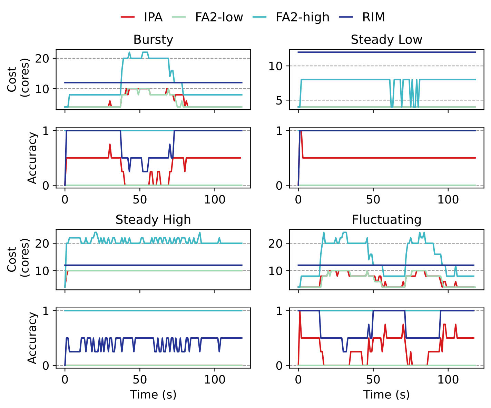
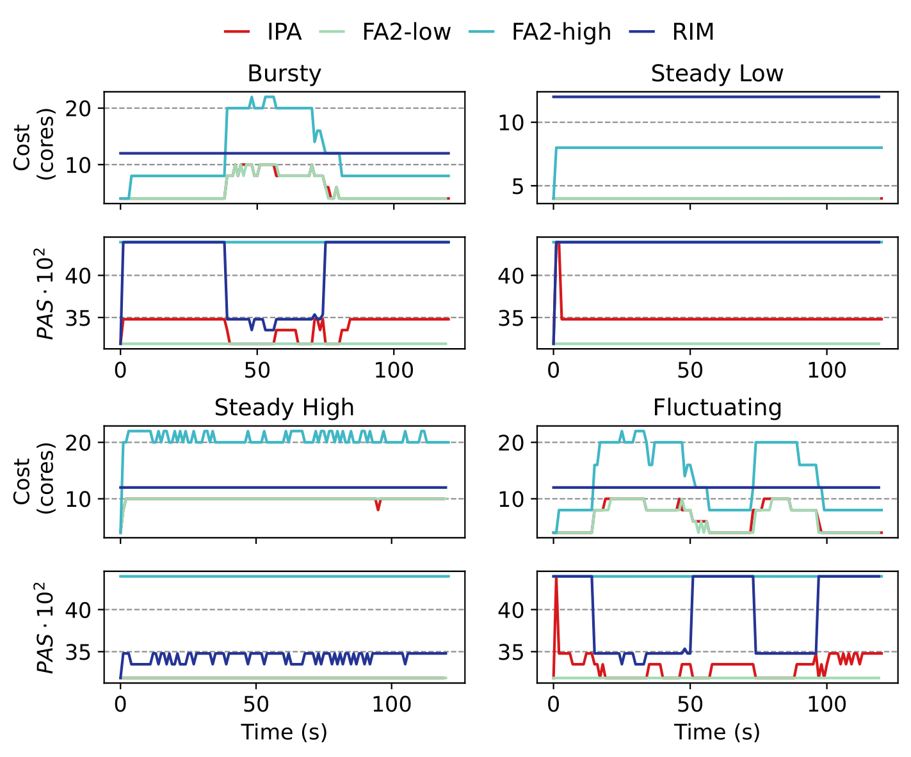
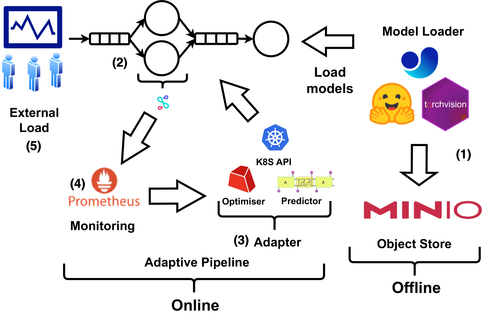

# Abstract
Efficiently optimizing multi-model inference pipelines for fast, accurate, and cost-effective inference is a crucial challenge in ML production systems, given their tight end-to-end latency requirements. To simplify the exploration of the vast and intricate trade-off space of accuracy and cost in inference pipelines, providers frequently opt to consider one of them. However, the challenge lies in reconciling accuracy and cost trade-offs. To address this challenge and propose a solution to efficiently manage model variants in inference pipelines, we present IPA, an online deep-learning Inference Pipeline Adaptation system that efficiently leverages model variants for each deep learning task. Model variants are different versions of pre-trained models for the same deep learning task with variations in resource requirements, latency, and accuracy. IPA dynamically configures batch size, replication, and model variants to optimize accuracy, minimize costs, and meet user-defined latency SLAs using Integer Programming. It supports multi-objective settings for achieving different trade-offs between accuracy and cost objectives while remaining adaptable to varying workloads and dynamic traffic patterns. Extensive experiments on a Kubernetes implementation with five real-world inference pipelines demonstrate that IPA improves normalized accuracy by up to 35% with a minimal cost increase of less than 5%.

# 1 Project Setup Steps (Automated Artifact Evaluation - For JSys Reviewers)
1. Go to the [infrastructure](/infrastructure/README.md) for the guide to set up the K8S cluster and related depandancies, the complete installtion takes ~30 minutes.

2. After downloading ipa data explained in 1 the log of the experiments presented in the paper will be avialable in the directory [data/results/final](data/results/final) to draw the figures in the paper go to [experiments/runner/notebooks](experiments/runner/notebooks) to draw each figure presented in the paper. Each figure is organized in a different Jupyter notebook e.g. to draw the figure 8 of the paper  pipeline figure [experiments/runner/notebooks/paper-fig8-e2e-video.ipynb](experiments/runner/notebooks/paper-fig8-e2e-video.ipynb). The notebooks for the results presented in the revised version of the manuscaripts with the new accuracy measure starts with the `paper-revision` prefix.

3. If you don't want to use the logs and want to check the main paper e2e experiments (E.g. paper's figure 8) do the following steps. IPA use config yaml files for running experiments, the config files used in the paper are stored in the `data/configs/final` folder. Depending on whether you want to regenerate the initial version or the revised version of the manuscript do one of these routes:
    
For the initial submitted version results:
1. Go to the `experiments/runner` and run `source run.sh`, this will take ~7 hours since each of the 20 experiments is conducted on a 20 minute load (20 * 20 = 400 minutes ~ 7 hours). The results and logs will be saved under `ipa/data/results/final/20` and the final figure will be in the `ipa/data/figures` under the name of `metaseries-20-video.pdf`
2. Go to the `experiments/runner/notebooks/Jsys-reviewers.ipynb` notebook to see the generated figure is same as the `paper-fig8-e2e-video.ipynb` that was generated from the downloaded log. Due to the K8S and distributed scheduling uncertainties there might be slight differences in the figures as shown below figures (for a sample run of the artifact evaluation) but the general trend should be the same.

For generating the revised version results:
1. Go to the `experiments/runner` and run `source run-revised.sh`, this will take ~7 hours since each of the 20 experiments is conducted on a 20 minute load (20 * 20 = 400 minutes ~ 7 hours). The results and logs will be saved under `ipa/data/results/final/21` and the final figure will be in the `ipa/data/figures` under the name of `metaseries-21-video.pdf`
2. Go to the `experiments/runner/notebooks/Jsys-reviewers-revised.ipynb` notebook to see the generated figure is same as the `paper-revision-fig8-e2e-video.ipynb` that was generated from the downloaded log. Due to the K8S and distributed scheduling uncertainties there might be slight differences in the figures as shown below figures (for a sample run of the artifact evaluation) but the general trend should be the same.


## Initial submission reproducibility
<table style="width: 100%; border-collapse: collapse;">
  <tr>
    <td style="width: 50%; text-align: center;">
      
      <br>
      <strong>Figure 8 in the paper</strong>
    </td>
    <td style="width: 50%; text-align: center;">
      
      <br>
      <strong>Sample artifact evaluation figure</strong>
    </td>
  </tr>
</table>

## Revised version submission reproducibility
<table style="width: 100%; border-collapse: collapse;">
  <tr>
    <td style="width: 50%; text-align: center;">
      
      <br>
      <strong>Figure 8 in the paper</strong>
    </td>
    <td style="width: 50%; text-align: center;">
      
      <br>
      <strong>Sample artifact evaluation figure</strong>
    </td>
  </tr>
</table>

## Experiment console
A typical log of an IPA run session:


## Kubernetes pod autoscaling
Pods being added/deleted by IPA autoconfiguration module:


# 2 Modules Overview

Here is the mapping between code modules and the IPA description in the paper:



1. [**Model Loader and Object Store**](models-to-minio): At the entry, IPA loads models to an object storage for cluster wide access of models in containers. IPA uses [Minio Object Store](https://min.io/).

2. [**Pipeline System**](pipelines): IPA inference pipeline management system uses a combination of open source technologies and self made modules. A forked version of [MLServer](https://mlserver.readthedocs.io/en/stable/) available in [here](MLServer) is used as the backend of the serving platform of model containers and queues. Each of the five inference pipelines introduced in the paper are availalbe in [pipelines](pipelines) folder. The pipelines containers are available in [pipelines/mlserver-centralized](pipelines/mlserver-centralized), the containers of queue and router are also available in [queue](pipelines/queue/) and [router](pipelines/router/). The router is the central request distributer for making the connections between model containers. Queue is also the central queue for stage of the infernece pipeline.

3. [**Adapter**](optimizer) This folder contains the [optimizer/adapter.py](optimizer/adapter.py) which is the apater module that periodically checks the state of the Kuberntes cluster and modifies the state of the cluster through [Kubernetes Python API](https://github.com/kubernetes-client/python). The logic of the Gurobi solver and simulating the pipeline are also available in other files in the same folder.

4. [**External Load generation module**](load_tester): This module is responsible for generating different load patterns in the paper. It uses load patterns from the Twitter trace dataset explained in the paper.

5. [**Monitoring**](experiments/utils/prometheus.py) The monitoring deamon uses [Prometheus](https://prometheus.io/) timeseries database for scrapping the incoming load in the inference pipeline.

6. **Other Modules** The code for other modules presented in the paper are available in the following folders:
    1. [Offline profiler](experiments/profiling/) of latency of models under different model variants and core assignments
    2. [LSTM load predictor](prediction-modules)
    3. [Preprocessing of the Twitter dataset](twitter-trace-preprocess)

# 3 Project Setup Steps (Manual)

1. Go to the [infrastructure](/infrastructure/README.md) for the guide to set up the K8S cluster and related depandancies, the complete installtion takes ~30 minutes.

2. IPA use config yaml files for running experiments, the config files used in the paper are stored in the `data/configs/final` folder.

3. To run a specific experiment and pipelines refer to the relevant `yaml` file in the `data/configs/final` folder. Set the `metaseries` and `series` field of the experiment for tagging this experiment. After setting the approperiate configs refer go to the [experiments/runner](experiments/runner) and run the relevant config file e.g.:
```bash
conda activate central
python runner_script.py --config-name sample-audio-qa
```
The log of the experiments are now available at `results/<metaseries>/<series>` of the experiments.

**Note**: For now we have provided all the configs used for the video pipelines for the artifact evaluation (explained in 1) and samples from other pipelines for intetersted users who wish to setup larger clusters for running the rest of the experiements. We are currently working on making the same automation for the video pipeline explained earlier for the rest of the inference pipelines.
